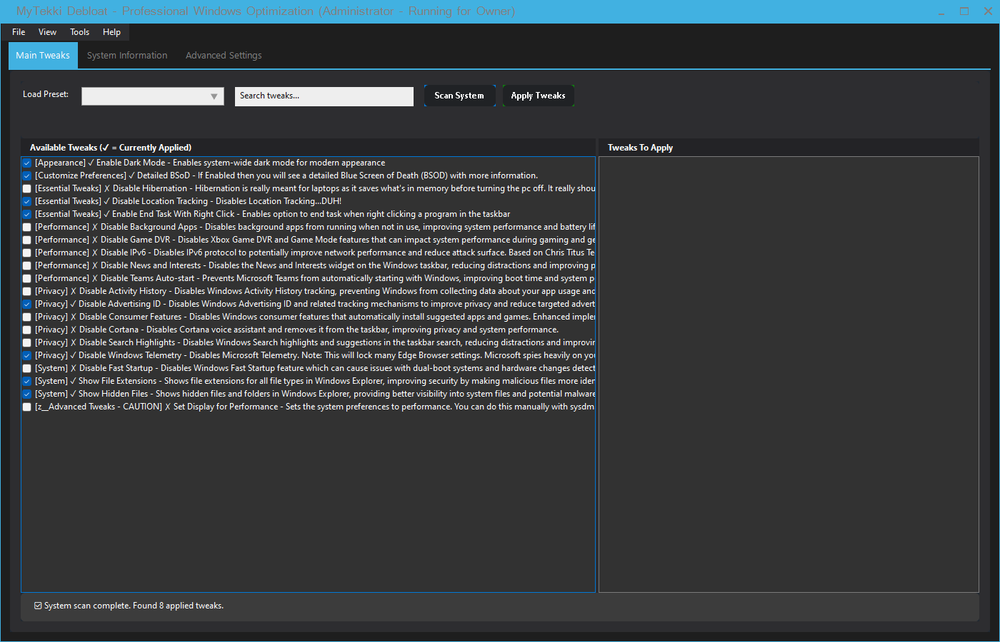
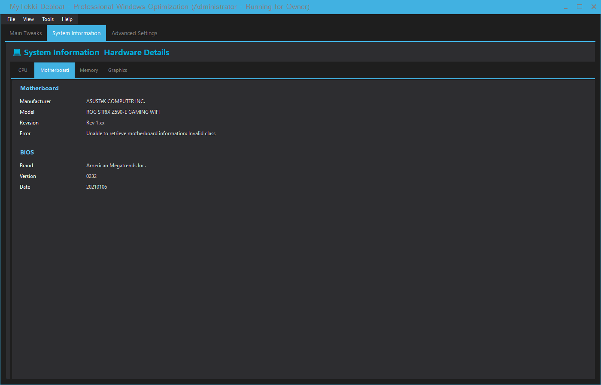
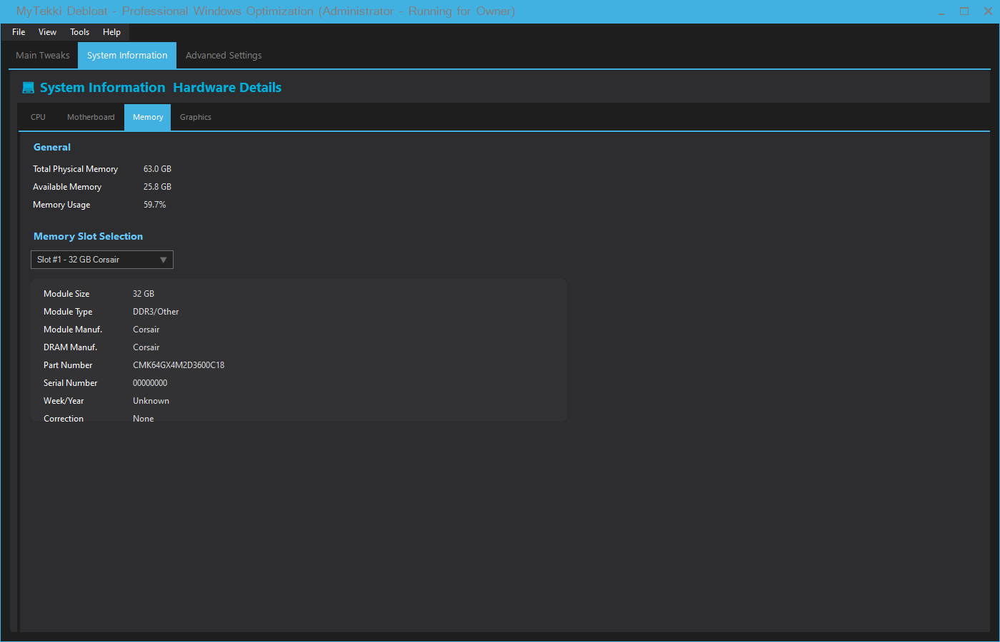
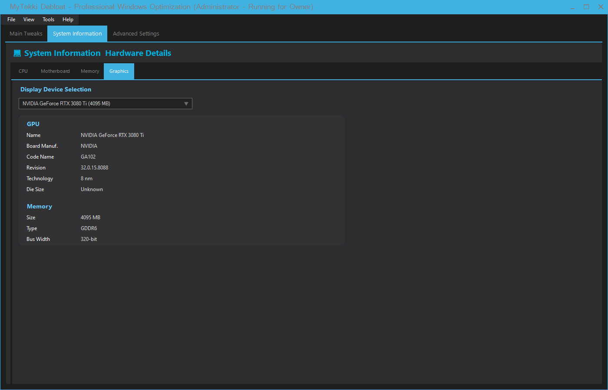

# 🚀 MyTekkiDebloat - Professional Windows Optimization

[](https://choosealicense.com/licenses/mit/)
[](https://dotnet.microsoft.com/download/dotnet/8.0)
[](https://github.com/Taiizor/ReaLTaiizor)
[](#)

A modern, developer-friendly .NET application that transforms **Chris Titus Tech's** proven Windows optimization techniques into a beautiful, professional interface with comprehensive system information capabilities.

## 📸 **Screenshots**

### 🎯 Main Tweaks Interface
*Professional dark theme with comprehensive tweak management*


### 💻 CPU-Z Style System Information  
*Complete hardware information with tabbed interface*

**CPU Information**


**Motherboard & BIOS**


**Memory & SPD Details**


**Graphics Cards with Multi-GPU Support**


---

## ✨ **Key Features**

### 🎨 **Professional Interface**
- **ReaLTaiizor Dark Theme** - Modern, consistent styling throughout
- **Responsive Design** - Adapts to different screen sizes and resolutions
- **Intuitive Navigation** - Clean tabbed interface with logical organization
- **Professional Appearance** - Matches commercial system utilities

### 💻 **CPU-Z Style System Information**
- **Comprehensive Hardware Detection** - CPU, Motherboard, Memory, Graphics
- **Multi-GPU Support** - Automatic detection and prioritization of dedicated graphics
- **Memory Slot Details** - Per-DIMM information including SPD data
- **Real-Time Information** - Live hardware status and performance metrics
- **Professional Layout** - Industry-standard information presentation

### 🛠️ **Advanced Tweak Management**  
- **66+ Optimization Tweaks** - Chris Titus Tech verified + MyTekki enhanced
- **Smart Detection** - Automatic system state analysis
- **Safe Operations** - Built-in rollback and system restore integration
- **Category Organization** - Privacy, Performance, Appearance, System tweaks
- **Progress Tracking** - Real-time operation status and completion

### � **Enterprise-Ready Security**
- **Administrator Detection** - Automatic privilege verification
- **Safe Execution** - Comprehensive error handling and validation
- **System Restore Integration** - Automatic backup points before changes
- **Audit Trail** - Complete operation logging and history

### 🎯 **User Experience Excellence**
- **Dynamic Window Titles** - Shows admin status and current user
- **Contextual Help** - Built-in guidance and tweak descriptions  
- **Progress Indicators** - Visual feedback for all operations
- **Professional Branding** - Consistent theme and messaging

---

## �🙏 **Acknowledgments & Special Thanks**

### **Chris Titus Tech - The Foundation**

This project is built upon the incredible work of **[Chris Titus Tech](https://github.com/ChrisTitusTech/winutil)** and his amazing **Windows Utility** project. 

**Chris**, your dedication to helping people optimize their Windows systems has been invaluable to the community. Your tweaks are battle-tested and trusted by thousands of users worldwide.

> 🤝 **To Chris**: We'd love to have you collaborate on this project! This extends your work into a flexible developer ecosystem where your expertise would be invaluable. Together, we can make Windows optimization accessible to both end-users and developers at any level.

### **Personal Dedication**

💝 Special thanks from the original author (Mike Daniels) to his two lovely kids **Maksim and Melanie Daniels** for their patience during the countless hours spent perfecting this application. This project is built with love and dedication to creating something truly special for the Windows community. 💖✨

---

## 🎯 **What Makes This Special**

### **🔧 For Developers**
- **Clean .NET API** - No PowerShell dependencies 
- **Type-Safe Operations** - IntelliSense support
- **Async/Await Pattern** - Modern C# practices
- **Extensible Architecture** - Add custom tweaks easily
- **Comprehensive Logging** - Full operation tracking

### **🖥️ For End-Users**  
- **Modern ReaLTaiizor UI** - Beautiful, responsive interface
- **Real-Time Detection** - See what's already applied
- **Safe Operations** - Built-in rollback capabilities
- **WinGet Integration** - Software management included

### **⚡ For Power Users**
- **PowerShell SDK** - Script-friendly cmdlets
- **Command-Line Tools** - Automation ready
- **Custom Repositories** - Your own tweak collections
- **Configuration Profiles** - Save and share setups

---

## 📦 **Quick Start**

### **🚀 Running the Application**

1. **Download or Clone the Repository**
   ```bash
   git clone https://github.com/xmikedanielsx/MyTekki-Debloat-Utility.git
   cd MyTekki-Debloat-Utility
   ```

2. **Build and Run**
   ```bash
   dotnet build MyTekkiDebloat.sln
   cd MyTekkiDebloat.WinUI\bin\Debug\net8.0-windows
   .\MyTekkiDebloat.WinUI.exe
   ```

3. **Enjoy the Experience!**
   - Explore the **System Information** tab for detailed hardware analysis
   - Check the **Main Tweaks** tab to optimize your system
   - Use **Advanced Settings** for additional configuration options

### **🔧 Development Setup**

**Prerequisites:**
- .NET 8.0 SDK or later
- Visual Studio 2022 or VS Code
- Windows 10/11 (for testing)

**Architecture:**
```
MyTekkiDebloat.sln
├── MyTekkiDebloat.Core/          # Core library with APIs
│   ├── Interfaces/               # Service contracts  
│   ├── Models/                   # Data structures
│   ├── Services/                 # Core implementations
│   └── Data/                     # Tweak definitions (JSON)
└── MyTekkiDebloat.WinUI/         # Desktop application
    ├── MainForm.cs               # Application interface
    └── Program.cs                # Application entry point
```

---

## 🛠️ **Technical Specifications**

### **🏗️ Architecture & Design**
- **Framework**: .NET 8.0 (Latest LTS)
- **UI Framework**: ReaLTaiizor for modern theming
- **Pattern**: Clean Architecture with SOLID principles
- **API Design**: Async/await throughout, cancellation support
- **Error Handling**: Comprehensive exception handling and logging

### **📊 Current Implementation Status**

| Category | Implemented | Planned | Total |
|----------|-------------|---------|-------|
| **Chris Titus Tech Verified** | 13 | 43+ | 56+ |
| **MyTekki Custom Enhanced** | 7 | 3+ | 10+ |
| **System Information** | ✅ Complete | - | CPU-Z Style |
| **UI Framework** | ✅ Complete | - | ReaLTaiizor |
| **Core Library** | ✅ Complete | - | Full API |

### **🎯 Available Tweaks & Features**

For complete details on all available tweaks, implementation status, and technical specifications, please see our comprehensive **[Tweaks Documentation](TweaksAvail.md)**.

**Quick Overview:**
- **20+ Implemented Tweaks** - Ready to use optimizations
- **46+ Planned Tweaks** - From Chris Titus Tech's proven library  
- **Multiple Categories** - Privacy, Performance, Appearance, System
- **Full Traceability** - Every tweak mapped to original CTT implementation

---

## 🤝 **Contributing**

We welcome contributions! Please see our [Contributing Guidelines](CONTRIBUTING.md) for details.

### **🎯 Ways to Contribute**
- 🐛 **Bug Reports** - Help us identify and fix issues
- 💡 **Feature Requests** - Suggest new tweaks or functionality  
- 🔧 **Code Contributions** - Submit pull requests for improvements
- 📚 **Documentation** - Help improve our guides and examples
- 🧪 **Testing** - Test on different Windows configurations

---

## 📄 **License**

This project is licensed under the MIT License - see the [LICENSE](LICENSE) file for details.

---

## 🌟 **Support the Project**

If you find this project helpful, please consider:
- ⭐ **Starring** the repository on GitHub
- 🐛 **Reporting bugs** and suggesting improvements
- 🤝 **Contributing** code or documentation
- 📢 **Sharing** with the Windows community

---

**Created with 💖 by Mike Daniels**  
*Professional Windows Optimization for Everyone*
Console.WriteLine($"🔍 Current Status: {(currentStatus.IsApplied ? "Applied" : "Not Applied")}");
```

### **🎨 WinForms Example with ReaLTaiizor**

```csharp
using ReaLTaiizor.Forms;
using ReaLTaiizor.Controls;
using MyTekkiDebloat.Core;

public partial class MainForm : MetroForm
{
    private readonly DebloatService _debloater;
    
    public MainForm()
    {
        InitializeComponent();
        _debloater = new DebloatService();
        LoadTweaks();
    }
    
    private async void LoadTweaks()
    {
        var tweaks = await _debloater.TweakProvider.GetTweaksAsync();
        
        foreach (var tweak in tweaks)
        {
            // Create modern checkbox for each tweak
            var checkbox = new MaterialCheckBox
            {
                Text = tweak.Name,
                Tag = tweak,
                AutoSize = true
            };
            
            // Check current system state
            var status = await _debloater.TweakDetector.GetTweakStatusAsync(tweak);
            checkbox.Checked = status.IsApplied;
            
            tweaksPanel.Controls.Add(checkbox);
        }
    }
    
    private async void ApplyButton_Click(object sender, EventArgs e)
    {
        var selectedTweaks = GetSelectedTweaks();
        
        var progress = new Progress<TweakExecutionProgress>(p => 
        {
            progressBar.Value = (int)p.PercentComplete;
            statusLabel.Text = $"Applying: {p.CurrentTweakName}";
        });
        
        var results = await _debloater.TweakExecutor.ApplyTweaksAsync(
            selectedTweaks, 
            progress, 
            CancellationToken.None
        );
        
        ShowResults(results);
    }
}
```

---

## 🛠️ **PowerShell SDK Usage**

```powershell
# Import the PowerShell module (coming soon)
Import-Module MyTekkiDebloat.PowerShell

# Get all available tweaks
$tweaks = Get-WinTweaks

# Apply privacy tweaks
$privacyTweaks = $tweaks | Where-Object { $_.Category -eq "Privacy" }
$privacyTweaks | Apply-WinTweak

# Check what's currently applied
Get-WinTweakStatus | Where-Object { $_.IsApplied -eq $true }

# Create a configuration profile
$config = @{
    Tweaks = @("DetailedBSOD", "DisableLocationTracking", "EndTaskOnTaskbar")
    Software = @("7zip", "GoogleChrome", "VsCode")
}
Export-WinTweakConfig -Config $config -Path "MyProfile.json"

# Apply from configuration
Import-WinTweakConfig -Path "MyProfile.json" | Apply-WinTweak
```

---

## 📚 **Current Tweak Library**

> 📊 **Complete tweak status and implementation tracking: [TweaksAvail.md](TweaksAvail.md)**

MyTekkiDebloat includes **20 implemented tweaks** with **46 additional tweaks** from Chris Titus Tech's library being evaluated for implementation. The comprehensive tracking table shows current status, implementation priorities, and development progress for all available tweaks.

**Quick Stats:**
- ✅ **20 Implemented** (14 CTT verified + 6 MyTekki custom)
- 🔄 **4 In Progress** (Network optimization focus)  
- 🔍 **42 In Review** (UI, privacy, and performance enhancements)

All tweaks include proper attribution, verified mappings to Chris Titus Tech's original implementations, and comprehensive safety validation.

For detailed information about all available tweaks and development priorities, see [TweaksAvail.md](TweaksAvail.md).

---

## 🏗️ **Architecture Overview**

```
MyTekkiDebloat.Core (NuGet Package)
├── 🔧 TweakEngine       # Core tweak application logic
├── 🔍 SystemDetector    # Real-time system state detection  
├── 📦 WinGetService     # Software installation management
├── 🗂️ RepositoryManager # Multi-repo support
├── ⚙️ ConfigService     # Profile and settings management
└── 📊 ReportingService  # Operation tracking and analytics

MyTekkiDebloat.UI (Reference Implementation)  
├── 🎨 ReaLTaiizor       # Modern UI components
├── 📱 Responsive Design # Adaptive interface
├── 🔄 Real-time Updates # Live system state reflection
└── 🎯 User Experience   # Intuitive operation flow
```

---

## 🏗️ **Architecture Overview**

```
MyTekkiDebloat.Core (NuGet Package)
├── 🔧 TweakEngine       # Core tweak application logic
├── 🔍 SystemDetector    # Real-time system state detection  
├── 📦 WinGetService     # Software installation management
├── 🗂️ RepositoryManager # Multi-repo support
├── ⚙️ ConfigService     # Profile and settings management
└── 📊 ReportingService  # Operation tracking and analytics

MyTekkiDebloat.UI (Reference Implementation)  
├── 🎨 ReaLTaiizor       # Modern UI components
├── 📱 Responsive Design # Adaptive interface
├── 🔄 Real-time Updates # Live system state reflection
└── 🎯 User Experience   # Intuitive operation flow
```

---

## 🤝 **Contributing**

We welcome contributions from the community! Whether you're:

- 🔧 **Adding new tweaks** based on your system optimization experience
- 🎨 **Improving the UI** with new ReaLTaiizor components  
- 📚 **Writing documentation** to help others
- 🐛 **Reporting bugs** or suggesting features
- 🔍 **Testing** on different Windows configurations

### **Special Invitation to Chris Titus Tech**
Chris, we'd be honored to have you as a collaborator on this project. Your expertise in Windows optimization would be invaluable in making this the definitive developer-friendly Windows optimization solution.

---

## �️ **Tweak Format & Contributing**

### **📋 JSON Tweak Schema**

MyTekkiDebloat uses a comprehensive JSON schema for defining Windows tweaks. Each tweak is a standalone JSON file in the `MyTekkiDebloat.Core\Data\` directory.

#### **Required Fields**
```json
{
  "Id": "UniqueTweakIdentifier",
  "Name": "Human-readable Tweak Name",
  "Description": "Detailed description of what this tweak does and why it's useful",
  "Category": "Privacy|Performance|Appearance|System|Security",
  "Severity": "Low|Medium|High",
  "Tags": ["tag1", "tag2", "descriptive-keywords"],
  "CTTKey": "WPFTweaksKeyName"
}
```

#### **Operation Types**

**Registry Operations:**
```json
"ApplyOperations": {
  "RegistryOperations": [
    {
      "Hive": "LocalMachine|CurrentUser|Users|ClassesRoot|CurrentConfig",
      "KeyPath": "SOFTWARE\\Path\\To\\Registry\\Key",
      "ValueName": "ValueName",
      "Value": "StringValue|1|true",
      "ValueType": "String|DWord|QWord|Binary|MultiString|ExpandString",
      "Operation": "SetValue|DeleteValue|DeleteKey|CreateKey"
    }
  ]
}
```

**PowerShell Operations:**
```json
"ApplyOperations": {
  "PowerShellOperations": [
    {
      "Script": "Get-Service -Name 'ServiceName' | Stop-Service -Force",
      "Description": "What this script does",
      "RequiresAdmin": true,
      "ExpectedExitCode": 0
    }
  ]
}
```

**Service Operations:**
```json
"ApplyOperations": {
  "ServiceOperations": [
    {
      "ServiceName": "DiagTrack",
      "Action": "Stop|Start|Disable|Enable",
      "StartupType": "Disabled|Manual|Automatic"
    }
  ]
}
```

#### **Detection Rules**
Every tweak must include detection rules to verify if it's already applied:

```json
"DetectionRules": [
  {
    "Type": "Registry",
    "Hive": "LocalMachine",
    "KeyPath": "SOFTWARE\\Path\\To\\Key",
    "ValueName": "ValueName",
    "ExpectedValue": 1,
    "ValueType": "DWord"
  },
  {
    "Type": "Service",
    "ServiceName": "ServiceName", 
    "ExpectedStatus": "Stopped",
    "ExpectedStartupType": "Disabled"
  },
  {
    "Type": "PowerShell",
    "Script": "(Get-ItemProperty -Path 'HKLM:\\SOFTWARE\\Path' -Name 'Value').Value -eq 1",
    "ExpectedResult": "True"
  }
]
```

#### **Undo Operations**
Provide safe rollback functionality:

```json
"UndoOperations": {
  "RegistryOperations": [
    {
      "Hive": "LocalMachine",
      "KeyPath": "SOFTWARE\\Path\\To\\Key",
      "ValueName": "ValueName",
      "Value": 0,
      "ValueType": "DWord",
      "Operation": "SetValue"
    }
  ]
}
```

#### **Multi-Author Attribution**
```json
"Authors": [
  {
    "Name": "Chris Titus",
    "Url": "https://github.com/ChrisTitusTech",
    "SupportUrl": "https://winutil.christitus.com/dev/tweaks/...",
    "Type": "Original",
    "Notes": "Original implementation from Chris Titus Tech's Windows utility"
  },
  {
    "Name": "Contributor Name",
    "Url": "https://github.com/username",
    "SupportUrl": "https://example.com",
    "Type": "Contributor",
    "Notes": "Enhanced with additional functionality or improvements"
  }
]
```

### **🤝 How to Contribute a Tweak**

> 📋 **Full contribution guidelines available in [CONTRIBUTING.md](CONTRIBUTING.md)**

**Quick contribution steps:**

1. **Fork the Repository**
   ```bash
   git clone https://github.com/YourUsername/MyTekkiDebloat.git
   cd MyTekkiDebloat
   ```

2. **Create Your Tweak JSON**
   - Create a new file in `MyTekkiDebloat.Core\Data\YourTweakName.json`
   - Follow the schema above completely
   - Ensure all required fields are present
   - Test detection rules work correctly

3. **Validate Your Tweak**
   ```csharp
   // Test in a console app or unit test
   var provider = new JsonTweakProvider();
   var tweaks = await provider.GetTweaksAsync();
   var yourTweak = tweaks.FirstOrDefault(t => t.Id == "YourTweakId");
   
   // Verify detection works
   var detector = new JsonDrivenTweakDetector();
   var status = await detector.GetTweakStatusAsync(yourTweak);
   ```

4. **Submit Pull Request**
   - Include a clear description of what your tweak does
   - Reference any source material or inspiration
   - Ensure proper attribution in Authors field
   - Test on a clean Windows installation if possible

See [CONTRIBUTING.md](CONTRIBUTING.md) for detailed guidelines, safety requirements, and quality standards.

### **✅ Tweak Validation Checklist**

Before submitting, ensure your tweak:

- [ ] Has a unique, descriptive `Id`
- [ ] Includes comprehensive `Description` 
- [ ] Has appropriate `Category` and `Severity`
- [ ] Contains relevant `Tags` for searchability
- [ ] Has `CTTKey` set (empty string if not from CTT)
- [ ] Includes complete `ApplyOperations`
- [ ] Has matching `DetectionRules` for all operations
- [ ] Provides safe `UndoOperations`
- [ ] Credits original authors properly
- [ ] Is tested and works as expected
- [ ] Doesn't conflict with existing tweaks

### **🎯 Contribution Priorities**

We especially welcome:
- **Performance Tweaks** - Registry optimizations, service configurations
- **Privacy Enhancements** - Telemetry disabling, data collection controls  
- **UI Improvements** - Visual effects, taskbar customizations
- **Security Hardening** - Windows Defender, firewall configurations
- **Developer Tools** - WSL, PowerShell, development environment tweaks

---

## �📄 **License**

This project is licensed under the MIT License - see the [LICENSE](LICENSE) file for details.

The MIT license ensures this remains free and open for everyone to use, modify, and contribute to, just like Chris's original work.

---

## 🔗 **Links & Resources**

- 📖 **Documentation**: [Coming Soon]
- 📊 **Comprehensive Tweak Status**: [TweaksAvail.md](TweaksAvail.md)
- 🤝 **Contributing Guide**: [CONTRIBUTING.md](CONTRIBUTING.md)
- 🎥 **Video Tutorials**: [Coming Soon] 
- 💬 **Community Discord**: [Coming Soon]
- 🐛 **Issue Tracker**: [GitHub Issues](https://github.com/YourUsername/MyTekkiDebloat/issues)
- 📦 **NuGet Package**: [Coming Soon]

### **Related Projects**
- 🌟 **[Chris Titus Tech WinUtil](https://github.com/ChrisTitusTech/winutil)** - The original inspiration
- 🎨 **[ReaLTaiizor](https://github.com/Taiizor/ReaLTaiizor)** - Modern UI framework we use
- 📦 **[WinGet](https://github.com/microsoft/winget-cli)** - Microsoft's package manager

---

## 💖 **Support**

If this project helps you, consider:

- ⭐ **Starring this repository** 
- 🐛 **Reporting bugs or suggesting features**
- 🤝 **Contributing code or documentation**  
- 💝 **Supporting Chris Titus Tech** for his foundational work

**Together, we're making Windows optimization accessible to everyone - from end-users to enterprise developers!** 🚀

---

*Built with ❤️ by developers who believe in making Windows better for everyone.*